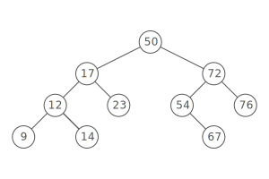

# Binary Tree



A binary tree is a tree where every node has two or fewer children. The children are usually called left and right.

```js
class BinaryTree {
  constructor(value){
    this.value = value
    this.left = null
    this.right = null
  }
}
```

## Types of Binary Trees

### Complete Binary Tree

A Complete binary tree is a binary tree in which all the levels of the tree are fully filled, except for perhaps the last level which can be filled from left to right.

Not a complete Binary Tree


A complete Binary Tree


